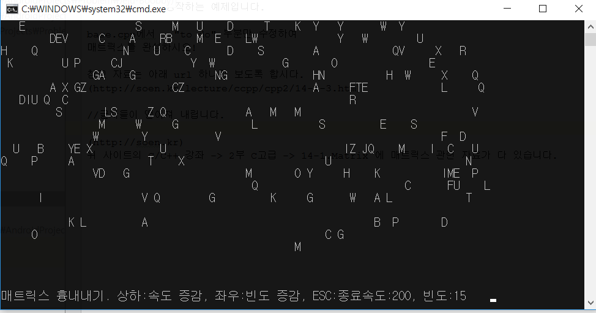

windows에서만 동작하는 예제입니다.

base.cpp에서   "to do" 부분만 수정하여
매트릭스를 완성하시오!

참고 자료는 아래 url 하나만 보도록 합시다.
(http://soen.kr/lecture/ccpp/cpp2/14-1-3.htm)

머리가 너무 복잡하다면 hint.md를 보세요.
//글자들이 떨어져 내립니다.

(http://soen.kr)
위 사이트의 C/C++ 강좌 -> 2부 C고급 -> 14-1.Matrix 에 매트릭스 관련 자료가 다 있습니다.
